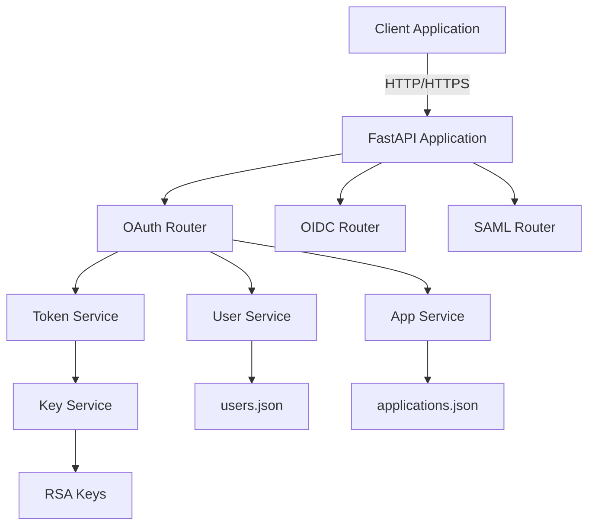
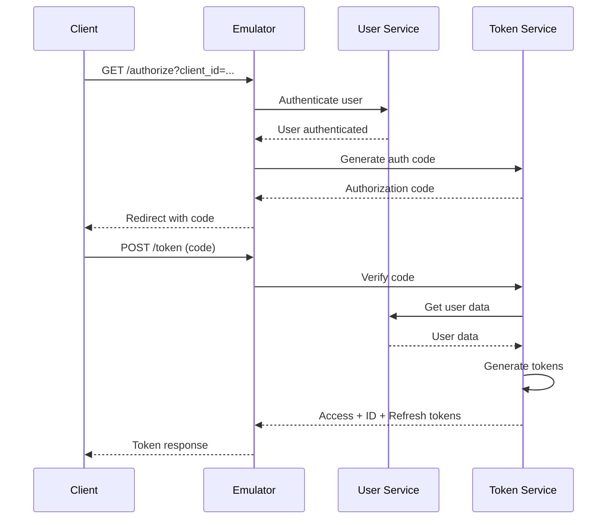

# Developer Manual - Microsoft Entra ID Emulator

Riferimento tecnico completo per sviluppatori che integrano o estendono l'emulatore Microsoft Entra ID.

---

## Table of Contents

1. [Architecture](#1-architecture)
2. [API Reference](#2-api-reference)
3. [Configuration](#3-configuration)
4. [Extensions](#4-extensions)
5. [MSAL Integration](#5-msal-integration)
6. [JWT Deep Dive](#6-jwt-deep-dive)
7. [Testing](#7-testing)
8. [Deployment](#8-deployment)

---

## 1. Architecture

### System Overview



### Component Architecture

#### 1. Core Application (`main.py`)
- FastAPI application instance
- CORS middleware
- Router registration
- Health endpoint

#### 2. Configuration (`config.py`)
- Environment-based settings
- Path management
- Issuer URL generation

#### 3. Data Models (`models/`)
- **User**: Office 365-compatible user model
- **Application**: OAuth client registration

#### 4. Services (`services/`)
- **KeyService**: RSA key generation and JWKS export
- **UserService**: User CRUD and authentication
- **AppService**: Application registry management
- **TokenService**: JWT generation and validation

#### 5. Routers (`routers/`)
- **OAuth**: Authorization and token endpoints
- **OIDC**: Discovery, JWKS, UserInfo
- **SAML**: Federation metadata

### Data Flow

#### Authorization Code Flow



---

## 2. API Reference

### OAuth 2.0 Endpoints

#### GET `/{tenant}/oauth2/v2.0/authorize`

Authorization endpoint per OAuth 2.0 code flow.

**Parameters**:
| Name | Type | Required | Description |
|------|------|----------|-------------|
| `client_id` | string | ✅ | Application client ID |
| `response_type` | string | ✅ | Deve essere `code` |
| `redirect_uri` | string | ✅ | URI di redirect registrato |
| `scope` | string | ✅ | Space-separated scopes |
| `state` | string | ⚠️ | Valore opaco per CSRF protection |
| `nonce` | string | ❌ | Per ID token validation |
| `code_challenge` | string | ❌ | PKCE challenge |
| `code_challenge_method` | string | ❌ | `S256` o `plain` |
| `test_user` | string | ❌ | **Testing only**: auto-login |

**Response**: Redirect a `redirect_uri` con parameters:
- `code`: Authorization code (10 min expiry)
- `state`: Echo del parametro inviato

**Example**:
```http
GET /common/oauth2/v2.0/authorize?
  client_id=test-app-123&
  response_type=code&
  redirect_uri=http://localhost:3029/callback&
  scope=openid%20profile&
  state=xyz
```

#### POST `/{tenant}/oauth2/v2.0/token`

Token endpoint per tutti i grant types.

**Grant Types Supportati**:
1. `authorization_code`
2. `client_credentials`
3. `refresh_token`
4. `password` (ROPC - testing only)

**Common Parameters**:
| Name | Type | Required | Description |
|------|------|----------|-------------|
| `grant_type` | string | ✅ | Grant type |
| `client_id` | string | ✅ | Application ID |
| `client_secret` | string | ⚠️ | Required for confidential clients |

**Authorization Code Parameters**:
| Name | Type | Required |
|------|------|----------|
| `code` | string | ✅ |
| `redirect_uri` | string | ✅ |
| `code_verifier` | string | ❌ |

**Client Credentials Parameters**:
| Name | Type | Required |
|------|------|----------|
| `scope` | string | ✅ |

**Refresh Token Parameters**:
| Name | Type | Required |
|------|------|----------|
| `refresh_token` | string | ✅ |
| `scope` | string | ❌ |

**ROPC Parameters**:
| Name | Type | Required |
|------|------|----------|
| `username` | string | ✅ |
| `password` | string | ✅ |
| `scope` | string | ❌ |

**Response** (Authorization Code / ROPC / Refresh):
```json
{
  "token_type": "Bearer",
  "expires_in": 3600,
  "ext_expires_in": 3600,
  "access_token": "eyJ0eXAi...",
  "refresh_token": "long-string...",
  "id_token": "eyJ0eXAi..."
}
```

**Response** (Client Credentials):
```json
{
  "token_type": "Bearer",
  "expires_in": 3600,
  "access_token": "eyJ0eXAi..."
}
```

### OpenID Connect Endpoints

#### GET `/{tenant}/v2.0/.well-known/openid-configuration`

OIDC Discovery Document.

**Response**:
```json
{
  "issuer": "http://localhost:8029/{tenant}/v2.0",
  "authorization_endpoint": "...",
  "token_endpoint": "...",
  "jwks_uri": "...",
  "userinfo_endpoint": "...",
  "scopes_supported": ["openid", "profile", "email", "offline_access"],
  "response_types_supported": ["code", "id_token", "code id_token"],
  "id_token_signing_alg_values_supported": ["RS256"],
  ...
}
```

#### GET `/{tenant}/discovery/v2.0/keys`

JWKS endpoint con chiavi pubbliche RSA.

**Response**:
```json
{
  "keys": [
    {
      "kty": "RSA",
      "use": "sig",
      "kid": "base64-key-id",
      "alg": "RS256",
      "n": "base64-modulus",
      "e": "base64-exponent"
    }
  ]
}
```

#### GET `/oidc/userinfo`

UserInfo endpoint (richiede Bearer token).

**Headers**:
```
Authorization: Bearer <access_token>
```

**Response**:
```json
{
  "sub": "user-id",
  "name": "Test User",
  "given_name": "Test",
  "family_name": "User",
  "preferred_username": "test@contoso.onmicrosoft.com",
  "email": "test@contoso.onmicrosoft.com"
}
```

### SAML Endpoints

#### GET `/{tenant}/FederationMetadata/2007-06/FederationMetadata.xml`

SAML 2.0 Federation Metadata.

**Response**: XML document con:
- Entity ID
- Signing certificate
- SSO endpoints
- Logout endpoints

---

## 3. Configuration

### Environment Variables

Tutte le configurazioni sono gestite tramite environment variables.

| Variable | Default | Description |
|----------|---------|-------------|
| `EMULATOR_HOST` | `0.0.0.0` | Bind address |
| `EMULATOR_PORT` | `8029` | Listen port |
| `TENANT_ID` | `common` | Default tenant ID |
| `ISSUER_URL` | `http://localhost:8029` | Base issuer URL |
| `TOKEN_EXPIRY_SECONDS` | `3600` | Access token lifetime |
| `REFRESH_TOKEN_EXPIRY_DAYS` | `14` | Refresh token lifetime |
| `DATA_DIR` | `/app/data` | Persistent data directory |
| `KEYS_DIR` | `/app/keys` | RSA keys directory |

### Docker Compose Configuration

```yaml
services:
  entra-emulator:
    environment:
      - EMULATOR_HOST=0.0.0.0
      - EMULATOR_PORT=8029
      - TENANT_ID=contoso
      - ISSUER_URL=http://localhost:8029
      - TOKEN_EXPIRY_SECONDS=3600
      - REFRESH_TOKEN_EXPIRY_DAYS=14
    ports:
      - "8029:8029"
    volumes:
      - ./data:/app/data
      - ./keys:/app/keys
```

### Custom Issuer URL

Per deployment su host diverso da localhost:

```yaml
environment:
  - ISSUER_URL=https://auth.example.com
```

⚠️ **Importante**: Aggiorna anche i `redirect_uri` nelle app registrate.

---

## 4. Extensions

### Custom User Store

Implementa un backend database al posto di JSON.

**1. Crea un nuovo UserService**:

```python
# services/db_user_service.py
from sqlalchemy import create_engine
from models.user import User

class DatabaseUserService:
    def __init__(self, db_url: str):
        self.engine = create_engine(db_url)
    
    def get_user_by_upn(self, upn: str) -> Optional[User]:
        # Query database
        pass
    
    def verify_password(self, upn: str, password: str) -> Optional[User]:
        # Verify against DB
        pass
```

**2. Registra il servizio**:

```python
# services/__init__.py
from .db_user_service import DatabaseUserService
import os

if os.getenv("USE_DATABASE"):
    user_service = DatabaseUserService(os.getenv("DATABASE_URL"))
else:
    user_service = UserService()  # Default JSON
```

### Custom Claims

Aggiungi claims personalizzati ai token.

**Modifica** `services/token_service.py`:

```python
def generate_access_token(self, user: User, app: Application, scope: str, tenant: str = "common") -> str:
    claims = {
        # ... existing claims ...
        
        # Custom claims
        "custom_role": user.jobTitle,
        "custom_dept": user.department,
        "custom_id": user.custom_field
    }
    
    return jwt.encode(claims, ...)
```

### Additional Scopes

Definisci scopes personalizzati.

**1. Aggiungi scope in** `applications.json`:

```json
{
  "appId": "my-app",
  "allowedScopes": [
    "openid",
    "profile",
    "email",
    "custom.read",
    "custom.write"
  ]
}
```

**2. Valida scopes in** `routers/oauth.py`:

```python
requested_scopes = scope.split()
allowed = set(app.allowedScopes)

if not set(requested_scopes).issubset(allowed):
    raise HTTPException(400, "invalid_scope")
```

### Multi-Tenancy

Supporta tenant multipli.

**1. Organizza dati per tenant**:

```
data/
  tenants/
    contoso/
      users.json
      applications.json
    fabrikam/
      users.json
      applications.json
```

**2. Modifica UserService**:

```python
def _load_users(self):
    tenant = config.TENANT_ID
    path = config.DATA_DIR / "tenants" / tenant / "users.json"
    # ...
```

---

## 5. MSAL Integration

### JavaScript/TypeScript (MSAL.js)

```typescript
import * as msal from "@azure/msal-browser";

const msalConfig = {
  auth: {
    clientId: "test-app-123",
    authority: "http://localhost:8029/common",
    redirectUri: "http://localhost:3029/callback",
  },
  cache: {
    cacheLocation: "localStorage",
  }
};

const msalInstance = new msal.PublicClientApplication(msalConfig);

// Login
await msalInstance.loginPopup({
  scopes: ["openid", "profile", "email"]
});

// Get token
const tokenResponse = await msalInstance.acquireTokenSilent({
  scopes: ["User.Read"],
  account: msalInstance.getAllAccounts()[0]
});
```

### Python (MSAL Python)

```python
from msal import PublicClientApplication

app = PublicClientApplication(
    client_id="test-app-123",
    authority="http://localhost:8029/common"
)

# Authorization code flow
result = app.acquire_token_interactive(
    scopes=["openid", "profile"],
    redirect_uri="http://localhost:3029/callback"
)

access_token = result["access_token"]
```

### .NET (MSAL.NET)

```csharp
using Microsoft.Identity.Client;

var app = PublicClientApplicationBuilder
    .Create("test-app-123")
    .WithAuthority("http://localhost:8029/common")
    .WithRedirectUri("http://localhost:3029")
    .Build();

var result = await app.AcquireTokenInteractive(
    new[] { "openid", "profile" }
).ExecuteAsync();

string accessToken = result.AccessToken;
```

### Confidential Client (.NET)

```csharp
var app = ConfidentialClientApplicationBuilder
    .Create("service-app-456")
    .WithClientSecret("service-secret")
    .WithAuthority("http://localhost:8029/common")
    .Build();

var result = await app.AcquireTokenForClient(
    new[] { "api://.default" }
).ExecuteAsync();
```

---

## 6. JWT Deep Dive

### Token Structure

JWT composto da 3 parti: Header, Payload, Signature.

```
eyJhbGciOiJSUzI1NiIsInR5cCI6IkpXVCIsImtpZCI6ImtleS1pZCJ9  // Header
.
eyJhdWQiOiJhcGk6Ly90ZXN0LWFwcC0xMjMiLCJpc3MiOiJodHRwOi8v... // Payload
.
signature-bytes-base64url-encoded                                  // Signature
```

### Header

```json
{
  "alg": "RS256",
  "typ": "JWT",
  "kid": "key-identifier"
}
```

- `alg`: Algorithm (RSA-SHA256)
- `typ`: Type (JWT)
- `kid`: Key ID per trovare chiave pubblica in JWKS

### Access Token Payload

```json
{
  "aud": "api://test-app-123",
  "iss": "http://localhost:8029/common/v2.0",
  "iat": 1705245600,
  "nbf": 1705245600,
  "exp": 1705249200,
  "aio": "random-correlation-id",
  "azp": "test-app-123",
  "azpacr": "1",
  "name": "Test User",
  "oid": "user-object-id",
  "preferred_username": "test@contoso.onmicrosoft.com",
  "rh": "refresh-token-family-id",
  "scp": "openid profile email",
  "sub": "subject-id",
  "tid": "tenant-id",
  "uti": "unique-token-id",
  "ver": "2.0"
}
```

**Claim Descriptions**:
- `aud`: Audience (API che deve accettare il token)
- `iss`: Issuer (chi ha emesso il token)
- `iat`: Issued At (timestamp)
- `nbf`: Not Before (timestamp)
- `exp`: Expiration (timestamp)
- `oid`: Object ID (user unique ID)
- `scp`: Scopes (permissions)
- `sub`: Subject (user ID)
- `tid`: Tenant ID

### ID Token Payload

```json
{
  "aud": "test-app-123",
  "iss": "http://localhost:8029/common/v2.0",
  "sub": "user-id",
  "email": "test@contoso.onmicrosoft.com",
  "name": "Test User",
  "given_name": "Test",
  "family_name": "User",
  "preferred_username": "test@contoso.onmicrosoft.com",
  "oid": "user-object-id",
  "nonce": "client-provided-nonce"
}
```

### Signature Verification

**Server-side validation** (Python):

```python
import jwt
from cryptography.hazmat.primitives import serialization
from cryptography.hazmat.backends import default_backend

# 1. Get JWKS
import requests
jwks = requests.get("http://localhost:8029/common/discovery/v2.0/keys").json()

# 2. Get kid from token header
from jwt import decode
header = jwt.get_unverified_header(token)
kid = header["kid"]

# 3. Find matching key
key_data = next(k for k in jwks["keys"] if k["kid"] == kid)

# 4. Convert JWK to PEM (simplified)
# In production use python-jose or jwcrypto

# 5. Verify
claims = jwt.decode(
    token,
    public_key_pem,
    algorithms=["RS256"],
    audience="api://your-app"
)
```

### Custom Validation

```python
def validate_token(token: str, expected_audience: str) -> dict:
    """Validate JWT with custom rules."""
    
    # 1. Decode without verification first
    unverified = jwt.decode(token, options={"verify_signature": False})
    
    # 2. Check expiration manually
    if datetime.utcnow().timestamp() > unverified["exp"]:
        raise ValueError("Token expired")
    
    # 3. Check audience
    if unverified["aud"] != expected_audience:
        raise ValueError("Invalid audience")
    
    # 4. Verify signature
    verified = jwt.decode(
        token,
        public_key,
        algorithms=["RS256"]
    )
    
    return verified
```

---

## 7. Testing

### Unit Testing

```python
# tests/test_token_service.py
import pytest
from services import token_service, user_service, app_service

def test_generate_access_token():
    user = user_service.get_user_by_upn("test@contoso.onmicrosoft.com")
    app = app_service.get_app_by_id("test-app-123")
    
    token = token_service.generate_access_token(
        user, app, "openid profile", "common"
    )
    
    assert token is not None
    
    # Decode and verify
    import jwt
    claims = jwt.decode(token, options={"verify_signature": False})
    assert claims["aud"] == "api://test-app-123"
    assert claims["sub"] == user.id
```

### Integration Testing

```python
# tests/test_oauth_integration.py
import httpx
import pytest

@pytest.fixture
def client():
    return httpx.Client(base_url="http://localhost:8029")

def test_full_authorization_flow(client):
    # 1. Get authorization code
    auth_response = client.get(
        "/common/oauth2/v2.0/authorize",
        params={
            "client_id": "test-app-123",
            "response_type": "code",
            "redirect_uri": "http://localhost:3029/callback",
            "scope": "openid profile",
            "test_user": "test@contoso.onmicrosoft.com"
        },
        follow_redirects=False
    )
    
    location = auth_response.headers["location"]
    code = location.split("code=")[1].split("&")[0]
    
    # 2. Exchange for token
    token_response = client.post(
        "/common/oauth2/v2.0/token",
        data={
            "grant_type": "authorization_code",
            "code": code,
            "redirect_uri": "http://localhost:3029/callback",
            "client_id": "test-app-123",
            "client_secret": "test-secret"
        }
    )
    
    assert token_response.status_code == 200
    tokens = token_response.json()
    assert "access_token" in tokens
    assert "id_token" in tokens
```

### Performance Testing (Locust)

```python
# locustfile.py
from locust import HttpUser, task, between

class EntraEmulatorUser(HttpUser):
    wait_time = between(1, 3)
    
    @task
    def get_token_client_credentials(self):
        self.client.post(
            "/common/oauth2/v2.0/token",
            data={
                "grant_type": "client_credentials",
                "client_id": "service-app-456",
                "client_secret": "service-secret",
                "scope": "api://.default"
            }
        )
    
    @task(2)
    def get_discovery_document(self):
        self.client.get(
            "/common/v2.0/.well-known/openid-configuration"
        )
```

Run:
```bash
locust -f locustfile.py --host=http://localhost:8029
```

---

## 8. Deployment

### Docker Production Build

```dockerfile
FROM python:3.11-slim as builder

WORKDIR /app
COPY requirements.txt .
RUN pip install --user --no-cache-dir -r requirements.txt

FROM python:3.11-slim

WORKDIR /app
COPY --from=builder /root/.local /root/.local
COPY . .

ENV PATH=/root/.local/bin:$PATH
EXPOSE 8029

CMD ["uvicorn", "main:app", "--host", "0.0.0.0", "--port", "8029", "--workers", "4"]
```

### Kubernetes Deployment

```yaml
apiVersion: apps/v1
kind: Deployment
metadata:
  name: entra-emulator
spec:
  replicas: 3
  selector:
    matchLabels:
      app: entra-emulator
  template:
    metadata:
      labels:
        app: entra-emulator
    spec:
      containers:
      - name: emulator
        image: entra-emulator:latest
        ports:
        - containerPort: 8029
        env:
        - name: ISSUER_URL
          value: "https://auth.k8s.local"
        - name: TOKEN_EXPIRY_SECONDS
          value: "3600"
        volumeMounts:
        - name: data
          mountPath: /app/data
        - name: keys
          mountPath: /app/keys
      volumes:
      - name: data
        persistentVolumeClaim:
          claimName: entra-data
      - name: keys
        persistentVolumeClaim:
          claimName: entra-keys
---
apiVersion: v1
kind: Service
metadata:
  name: entra-emulator
spec:
  selector:
    app: entra-emulator
  ports:
  - port: 80
    targetPort: 8029
  type: LoadBalancer
```

### HTTPS/TLS

⚠️ **Non implementato nell'emulatore** - usa reverse proxy.

**Nginx reverse proxy**:

```nginx
server {
    listen 443 ssl;
    server_name auth.example.com;
    
    ssl_certificate /etc/ssl/certs/cert.pem;
    ssl_certificate_key /etc/ssl/private/key.pem;
    
    location / {
        proxy_pass http://localhost:8029;
        proxy_set_header Host $host;
        proxy_set_header X-Real-IP $remote_addr;
        proxy_set_header X-Forwarded-For $proxy_add_x_forwarded_for;
        proxy_set_header X-Forwarded-Proto $scheme;
    }
}
```

### Monitoring

**Prometheus metrics** (da implementare):

```python
# main.py
from prometheus_client import Counter, Histogram, make_asgi_app

token_requests = Counter('token_requests_total', 'Total token requests')
token_duration = Histogram('token_generation_seconds', 'Token generation time')

metrics_app = make_asgi_app()
app.mount("/metrics", metrics_app)
```

### Logging

```python
# config.py
import logging
import sys

logging.basicConfig(
    level=logging.INFO,
    format='%(asctime)s - %(name)s - %(levelname)s - %(message)s',
    handlers=[
        logging.StreamHandler(sys.stdout),
        logging.FileHandler('/var/log/entra-emulator.log')
    ]
)

logger = logging.getLogger(__name__)
```

---

## Security Considerations

⚠️ **IMPORTANTE**: Questo emulatore è per **testing/development ONLY**.

### Limitazioni di Sicurezza

1. **No encryption at rest** - Chiavi e dati non cifrati
2. **HTTP only** - No TLS/SSL built-in
3. **Simple password hashing** - bcrypt senza salt rotation
4. **No rate limiting** - Vulnerabile a brute force
5. **No audit logging** - Nessuatracker per accessi
6. **Static secrets** - Client secrets in plaintext

### Per Produzione

Se DEVI usare in produzione (sconsigliato):

1. **Usa HTTPS** con reverse proxy
2. **Implementa rate limiting** (nginx, Kong, etc.)
3. **Audit logging** completo
4. **Rotate secrets** periodicamente
5. **Database encryption** per dati sensibili
6. **Network isolation** - firewall rules
7. **Container security scanning**

---

## API Changelog

### v1.0.0 (Current)
- OAuth 2.0 completo
- OpenID Connect
- SAML Federation Metadata
- JWT con RS256
- Docker deployment

### Future Enhancements
- Token revocation endpoint
- Device code flow
- Certificate-based authentication
- Multi-factor authentication simulation
- Admin API per gestione utenti/app

---

## Contributing

Per contribuire all'emulatore:

1. Fork del progetto
2. Branch feature (`git checkout -b feature/amazing-feature`)
3. Commit (`git commit -m 'Add amazing feature'`)
4. Push (`git push origin feature/amazing-feature`)
5. Pull Request

### Code Style

- Python: PEP 8
- Type hints obbligatori
- Docstrings per funzioni pubbliche
- Test coverage > 80%

---

## License

MIT License - vedi LICENSE file.

---

## Support

- Issues: [GitHub Issues](https://github.com/your-repo/issues)
- Documentation: Questo manual + User Manual
- Community: [Discussions](https://github.com/your-repo/discussions)
